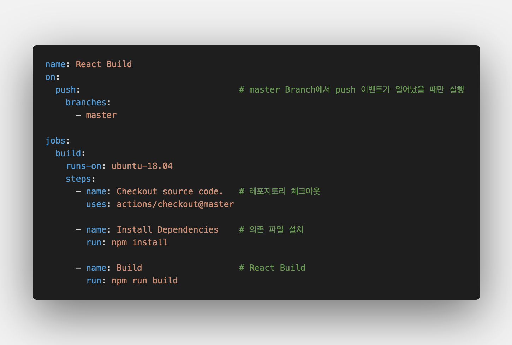
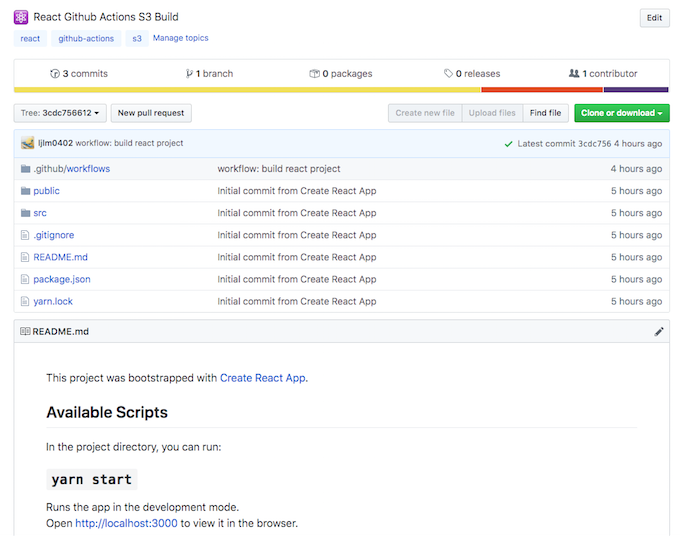
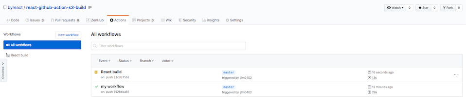
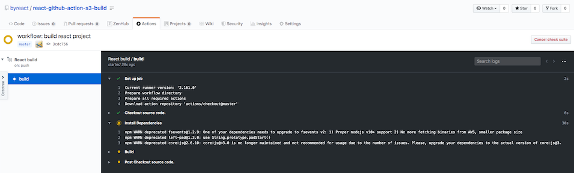
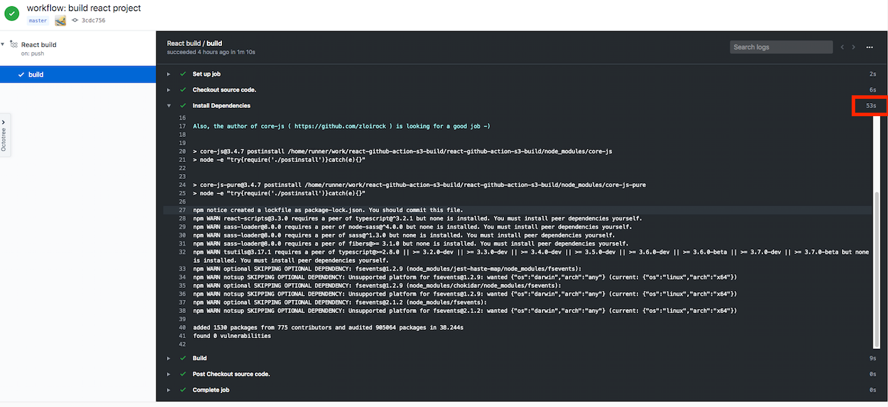
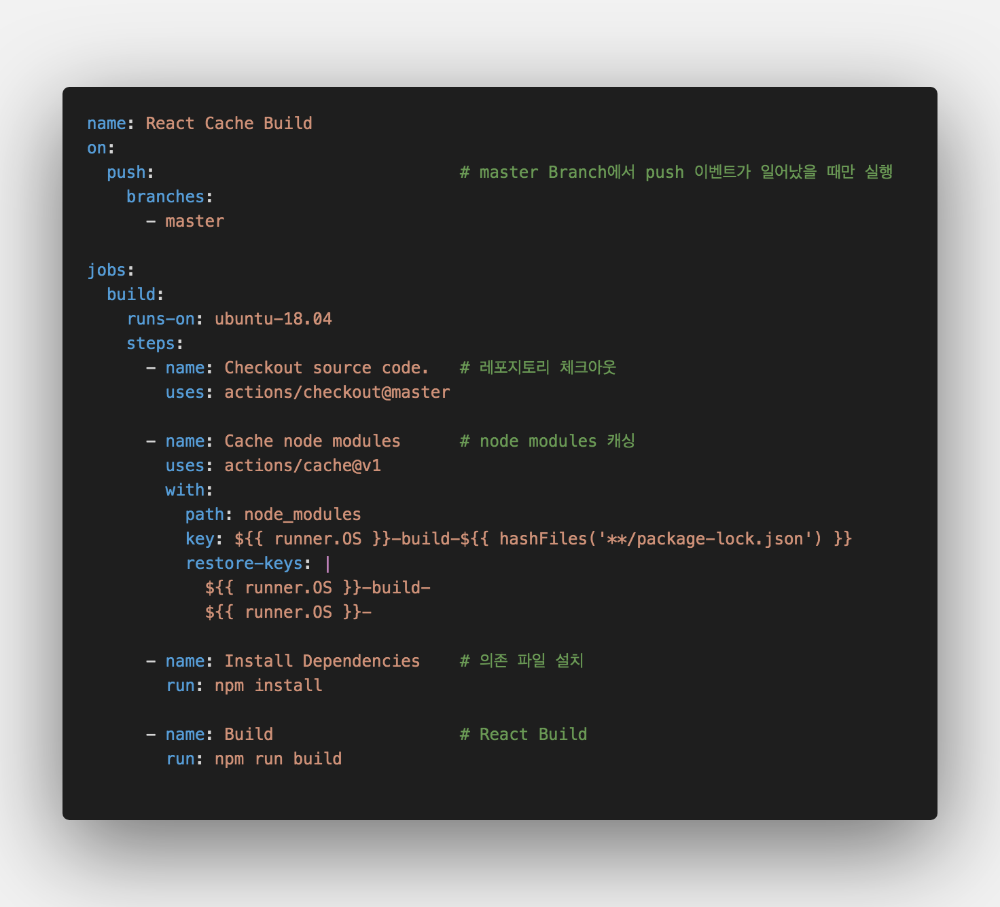
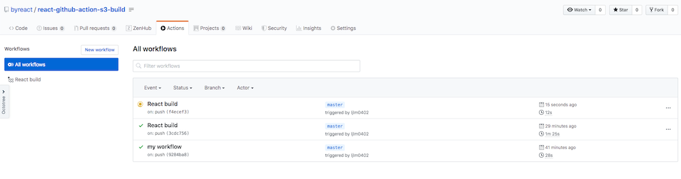
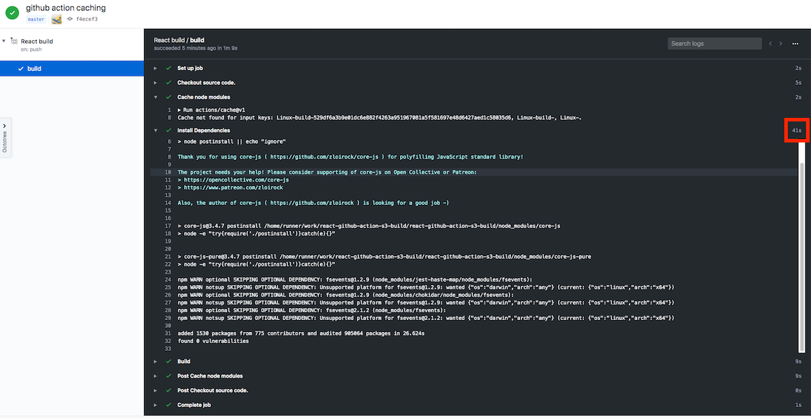
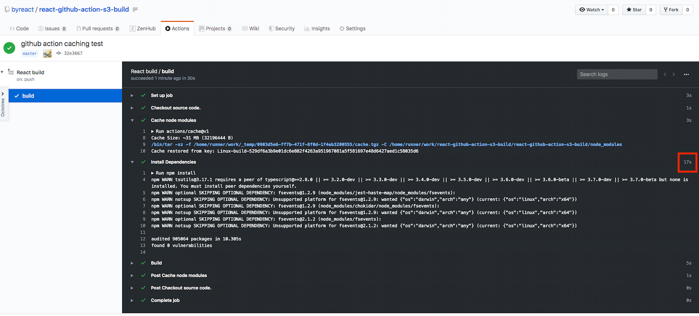

<center>github에서 공개한 <strong style="color:#2A7CF2; font-size: 20px;">빌드/배포 자동화 서비스</strong></center>

## **💎 목차**

- [서론 (Introduction)](#-서론)
- [본론 (Main)](#-본론)
- [결론 (Conclusion)](#🥀-결론)

## **🌱 서론**

안녕하세요~ 어느덧 추운 겨울이 왔습니다.

또한, 얼마전에 겨울왕국2 ⛄️가 개봉했는데

저는 이번주에 용산 IMAX 보러갈 예정입니다!!

자 그럼 이번 포스팅도 힘차게 진행해 보겠습니다.

그 전에 배운 내용을 정리하면

1. React 프로젝트 생성 (CRA)

2. Github Actions 시작 (workflow 작성)

까지 진행했었습니다.

**2탄**에서는 `React Build, actions/cache` 해보겠습니다.

<br />

**[⬆ 목차](#-목차)**

<hr />

## **🌹 본론**

### **▸ React Build**

React는 기본적으로 SPA(Single Page Application) 입니다.

그러기 때문에, 한 페이지 내에 자바스크립트들을 불러와 화면을 구축하는 방식입니다.

`npm run build` 스크립트 실행시, 정적 파일들로 구축을 해주기 때문에

`build` 폴더 안에 있는 index.html을 실행하면 자신의 홈페이지를 볼 수 있습니다.

마지막 포스팅에서는 build 파일을 S3 스토리지에 올리는 것을 목표로 두고있습니다.

#### **▸ Workflow 생성하기**

**1탄**에서 작성했던 `main.yml` 파일을 지우고 다시 작성하겠습니다.


<br />

steps를 차근 차근 살펴보겠습니다.

1. Checkout source code - 레포지토리 파일을 받아옵니다.

2. Install Dependencies - `npm install` 명령어를 실행하여 의존 파일 설치

3. Build - `npm run build` 명령어를 실행하여 정적 파일들을 생성합니다.

자 그럼 Github에 `push` 해보겠습니다.

```sh
$ git add .

$ git commit -m "workflow: build react project"

$ git push -u origin master

```


<br />

정상적으로 push가 된것을 확인해 보았고, Actions 탭으로 들어가보겠습니다.


<br />

workflows에 `React build`라는 새로운 플로우가 생겼습니다.

주황색 불빛으로 현재 실행중이라는것을 확인할수 있는데요

그럼 해당 workflow를 클릭하여 자세히 보도록 하겠습니다.


<br />

해당 workflow가 실시간으로 빌드하는 과정을 살펴볼 수 있습니다.

`step` 별로 빌드가 되고 있으며 해당 step 클릭하면 상세 로깅도 볼수 있습니다.


<br />

`Install Dependencies` step은 의존성 모듈을 설치하는 step입니다.

해당 step의 상세 로깅을 보면 무려 53초나 걸렸습니다.

이는 앞으로 매번 빌드할 때마다 해당 모듈을 설치함으로서 시간적인 소요가 많이 걸린다는 것입니다.

현재는 프로젝트 소스에 의존성 모듈이 적어서 53초이지만 추후에 많은 모듈을 설치함으로써 소요시간이 증가합니다.

그래서! Github Action에서는 파일을 `Caching`하는 방법이 존재합니다.

폴더마다 약 400MB까지 캐싱할 수 있다고 하니 node_modules 폴더를 캐싱하는데는 충분할 것 같습니다.

#### **▸ actions/cache**

Github Action에서 캐싱을 해보겠습니다.


<br />

위와 같이 node_modules를 캐싱하는 `step`를 추가합니다.

이는 [actions/cache](https://github.com/actions/cache) 액션을 `uses`를 통하여 가져와 실행합니다.

또한 with 구문으로 설정할 수 있는데, `path`와 `key`를 반드시 설정해주어야 합니다.

- path : 저장하고 불러올 캐시 대상 폴더

- key : 저장 하고 불러올 때 식별할 수 있는 키 값

- restore-keys (optional) : 캐시 key가 일치하는 것이 없을때, 차선택으로 캐싱 폴더를 찾는 key

이제 코드를 github에 두번 올려보겠습니다.

두번 올리는 이유는 첫번째는 캐시해서 저장하고, 두번째는 캐싱된 폴더를 불러오기 위해서입니다.

위에 설정한 코드를 보시면 `**/package-lock.json` 식별키로 해놨습니다.

현재 프로젝트에는 `package-lock.json`이 존재하지 않으니 반드시 `npm install` 명령어를 하신후에 push 하시기 바랍니다.

```sh
$ npm install

$ git add .

$ git commit -m "github action caching"

$ git push -u origin master
```


<br />

Actions 탭을 확인하시면 `React build` 라는 workflow를 클릭합니다.


<br />

`Cache node modules` 탭을 클릭해보시면 `Cache not found for Keys` 라고 뜹니다.

`Install Dependencies` 탭에서 의존성 모듈 설치는 41초 입니다.

이제 두번째 push 를 해보겟습니다.


<br />

`Cache node modules` 탭을 클릭해보시면 `Cache restored from key`라며 키 값을 캐싱하였습니다.

`Install Dependencies` 탭에서 의존 파일 설치는 17초 입니다.

2배보다 빠른 속도로 빌드가 된것입니다.

앞으로 프로젝트에 의존 모듈이 설치 할수록 캐싱을 한 것은 더더욱 빛을 발할 것입니다.

<br />

**[⬆ 목차](#-목차)**

<hr />

## **🥀 결론**

이번 포스팅은 여기까지입니다 ~

저도 cache를 접하면서 새로운 신세계에 눈을 떳습니다.

다른 CI에서는 가능한지도 한번 알아봐야겠어요 🤪

만약에 없다고하면 Github Actions의 시대가 올거라고 생각합니다 (개인 피셜)

자 앞서 배운 내용을 정리하면

1. React Build

2. Github Action Cache

를 해보았습니다.

다음 포스팅에서는 `AWS S3 정적 사이트 설정 및 React 배포`를 해보겠습니다.

<br />

**[⬆ 목차](#-목차)**

<hr />

<br />

# 여러분의 댓글이 큰힘이 됩니다. (๑•̀ㅂ•́)و✧
