<center>github에서 공개한 <strong style="color:#2A7CF2; font-size: 20px;">빌드/배포 자동화 서비스</strong></center>

## **💎 목차**

- [서론 (Introduction)](#-서론)
- [본론 (Main)](#-본론)
- [결론 (Conclusion)](#🥀-결론)

## **🌱 서론**

안녕하세요~ 오늘도 날씨가 굉장히 추워요 🤧

다들 감기 조심하시고 따듯하게 입으시길 바랍니다.

자 그럼 이번 포스팅도 힘차게 진행해 볼까요 ?

그 전에 배운 내용을 정리하면

1. React 프로젝트 생성 (CRA)

2. Github Actions 시작 (workflow 작성)

3. React Build

4. Github Actions / cache

까지 진행했었습니다.

**3탄**에서는 `AWS S3 정적 사이트 설정 및 React 배포`를 해보겠습니다.

<br />

**[⬆ 목차](#-목차)**

<hr />

## **🌹 본론**

### **▸ AWS S3**

Amazon Simple Storage Service(S3)라고 불리며

어디서나 원하는 양의 데이터를 저장하고 검색할 수 있도록 구축된 객체 스토리지입니다.

이 서비스를 사용하여 웹 사이트, 모바일 애플리케이션, 백업 및 복원 등등 데이터를 저장하고 보호할 수 있습니다.

자세한 내용은 [AWS S3](https://aws.amazon.com/ko/s3/)를 참고하시기 바랍니다.

#### **▸ S3 버킷 설정하기**

[Amazon Web Services](http://aws.amazon.com/) 계정이 없으신 분들은 가입후 진행하시기 바랍니다.

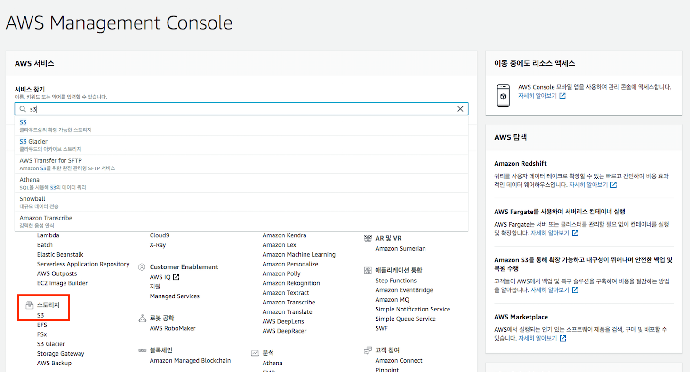
<br />

AWS Management Console 페이지에서 서비스를 검색 혹은

스토리지 카테고리에 S3를 찾아 들어가줍니다.

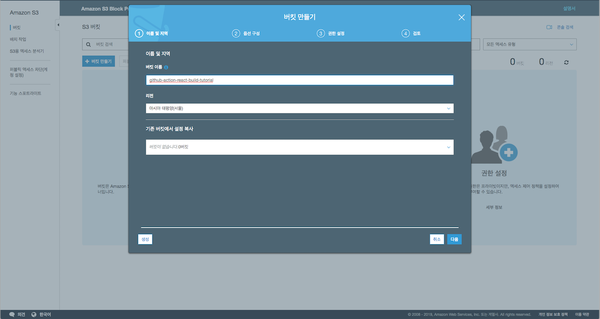
<br />

`버킷 만들기` 버튼을 클릭하면 버킷 이름을 작성하고 생성 버튼을 클릭합니다.

참고로 버킷 이름은 유니크해야하기 때문에 **다른 이름을 사용**하시기 바랍니다.

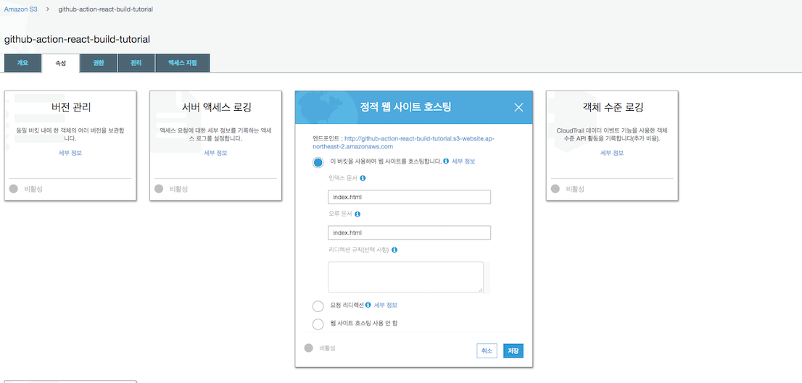
<br />

생성을 완료하고 나서 해당 버킷을 클릭하여 상세 페이지로 이동합니다

그 후, 속성 탭에서 `정적 웹 사이트 호스팅`을 클릭하여

인덱스 문서, 오류 문서를 `index.html`로 설정 후 저장해줍니다.

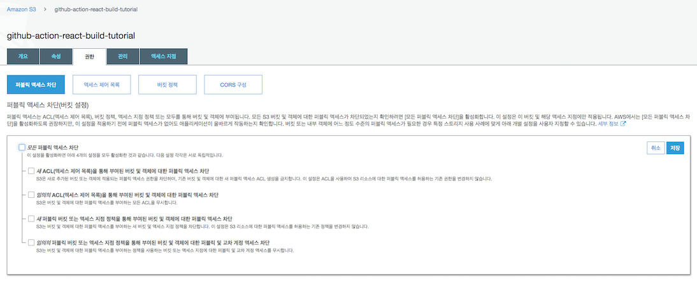
<br />


<br />

정적 웹 사이트 호스팅 설정을 완료했으면

다음 `권한` 탭으로 이동하여 `편집` 버튼 클릭후

`모든 퍼블릭 엑세스 차단`을 풀어줍니다.

저장 버튼을 누르면 확인창까지 마무리를 해줍니다.

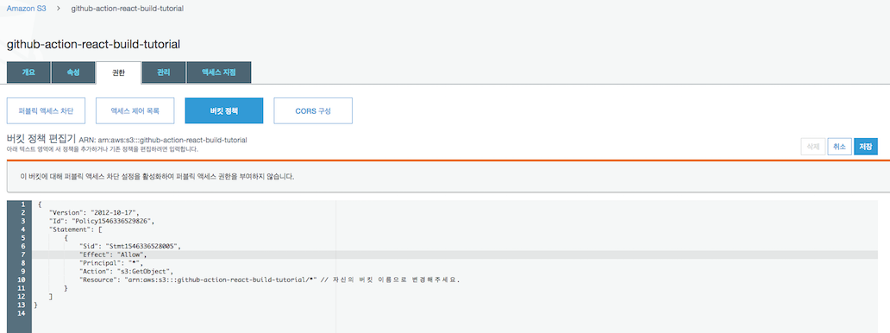
<br />

`버킷 정책` 탭으로 이동하여 다음과 같이 코드를 입력해 줍니다.

```sh
{
    "Version": "2012-10-17",
    "Id": "Policy1546336529826",
    "Statement": [
        {
            "Sid": "Stmt1546336528005",
            "Effect": "Allow",
            "Principal": "*",
            "Action": "s3:GetObject",
            "Resource": "arn:aws:s3:::github-action-react-build-tutorial/*" # 자신의 버킷 이름으로 설정해주세요
        }
    ]
}
```

<br />

여기까지 잘 따라오셨으면 일단 S3 설정은 끝났습니다.

다음으로 넘어가겠습니다.

<br />
<hr />

### **▸ AWS IAM**

AWS Identity and Access Management(IAM) 라고 불리며

AWS 서비스와 리소스에 대한 액세스를 안전하게 관리할 수 있습니다.

또한, AWS 사용자 및 그룹을 만들고 관리하며 AWS 리소스에 대한 액세스를 허용 및 거부할 수 있습니다.

자세한 내용은 [AWS IAM](https://aws.amazon.com/ko/iam/)를 참고하시기 바랍니다.

#### **▸ AWS CLI 권한 생성하기**

다음으로 CLI (Command Line Interface)로 버킷에 접근하기 위한 권한을 생성하겠습니다.

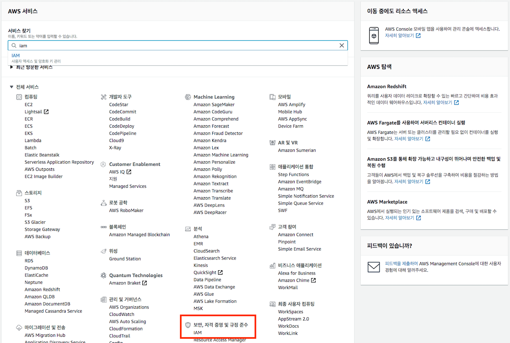
<br />

AWS Management Console 페이지에서 서비스를 검색 혹은

보안, 자격 증명 및 규정 준수 카테고리에 IAM를 찾아 들어가줍니다.

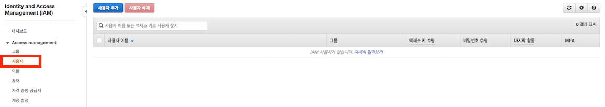
<br />

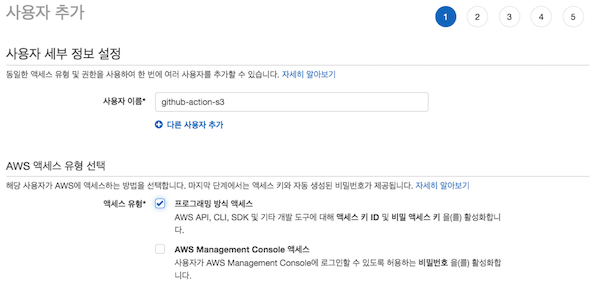
<br />

좌측 대시보드에 `Access management` 카테고리에 사용자를 클릭

`사용자 추가` 버튼을 클릭하면 사용자 세부 정보 설정과 액세스 유형 선택이 존재합니다.

사용자 이름은 자신이 원하시는 이름으로 설정합니다.

예제에서는 `github-action-s3`라고 작성하였고

프로그래밍 방식 엑세스를 체크하고 `다음: 권한` 버튼 클릭해줍니다.

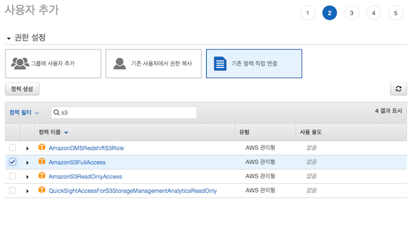
<br />

`기존 정책 직접 연결` 탭을 클릭한 후

검색 란에 `s3` 검색하시면 `AmazonS3FullAccess` 체크 후

`다음: 태그` 버튼을 클릭해줍니다.

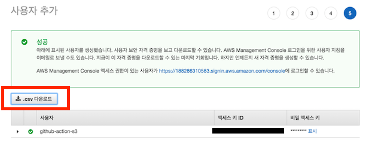
<br />

계속 다음으로 넘거가주면 마지막에 생성된걸 확인할수 있습니다.

여기서 `엑세스 키 ID, 비밀 엑세스 키`를 반드시 기억하시기 바랍니다.

`.csv 다운로드` 하시면 편안하게 관리하실수 있으니 권장합니다.

<br />
<hr />

### **▸ Github Actions Secrets**

Github Actions에서 제공하는 기능으로

암호된 비밀을 통해 액세스 토큰과 같은 민감한 정보를 레포지토리에 저장할 수 있는 기능입니다.

자세한 내용은 [secrets](https://help.github.com/en/actions/automating-your-workflow-with-github-actions/creating-and-using-encrypted-secrets)를 참고하시기 바랍니다.

해당 기능을 사용하여 AWS에서 얻은 `엑세스 키 ID, 비밀 엑세스 키`를 등록하겠습니다.

#### **▸ Secrets에 민감한 정보 저장하기**

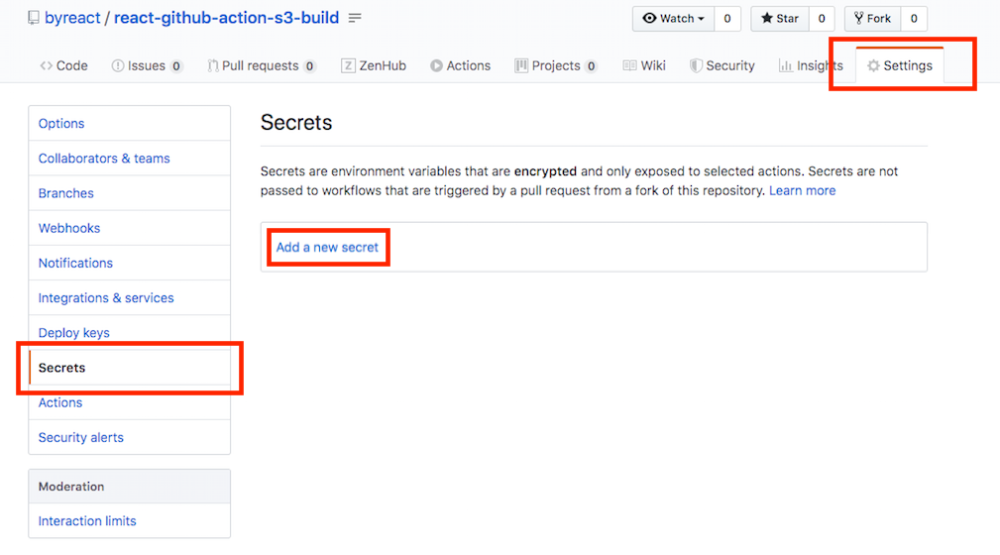
<br />

지금까지 작업했던 레포지토리에 들어가셔서

`Settings` 탭을 클릭하신후 왼쪽 `Secrets` 탭을 클릭하여 이동합니다.

그 후, `Add a new secret` 버튼을 눌러

`AWS_ACCESS_KEY_ID`, `AWS_SECRET_ACCESS_KEY`를 생성하겠습니다.

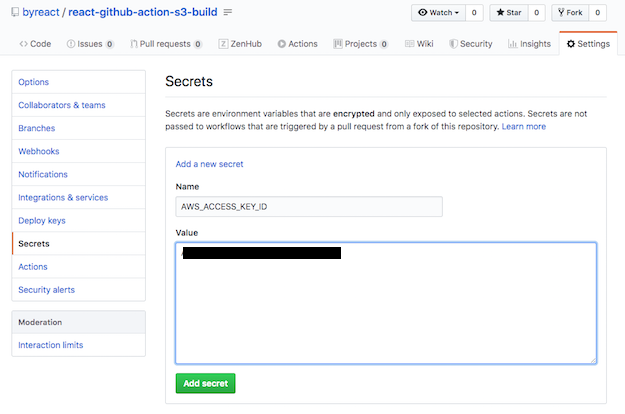
<br />

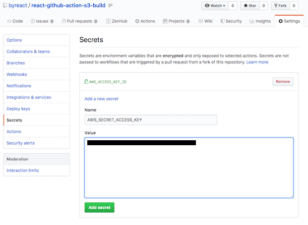
<br />

생성을 정상적으로 하셨으면 다음과 같이 두개의 리스트가 보일겁니다.

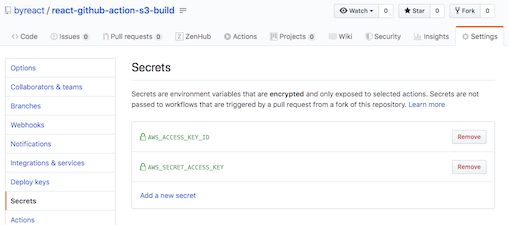
<br />

### **▸ Gihub Action S3 업로드하기**

이제 마지막으로 소스를 수정하겠습니다.

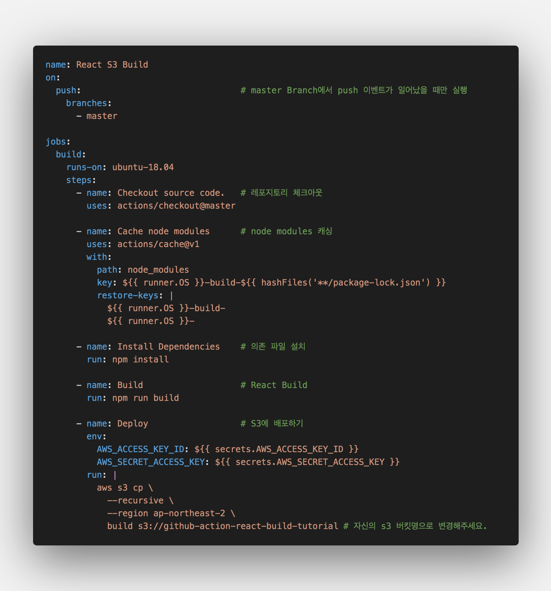
<br />

`main.yml` 파일을 수정하였습니다.

맨 하단 `Deploy` step을 추가 하였는데

`env`에서는 secrets 해당 생성했던 Name 접근하여 Value를 가져오는 코드이며

`run`에서는 `aws s3 cp`로 step에서 빌드한 build 폴더의 내용을 자신의 버킷으로 복사하여 줍니다.

aws 명령어를 사용할 수 있는 이유는 github action에서 가상환경 구축 시 자동으로 설치 되어있기 때문입니다.

설치 되어있는 소프트웨어는 [여기](https://help.github.com/en/actions/automating-your-workflow-with-github-actions/software-installed-on-github-hosted-runners#ubuntu-1804-lts)를 참고해주시기 바랍니다.

참고로 현재 가상 환경은 ubuntu-18.04 입니다.

소스까지 수정이 완료되었으면 이제 github에 소스코드를 push 해줍니다.

```sh
$ git add .

$ git commit -m "github actions s3 build"

$ git push -u origin master

```

Actions 탭으로 가셔서 정상적으로 빌드가 됬는지 확인합니다.

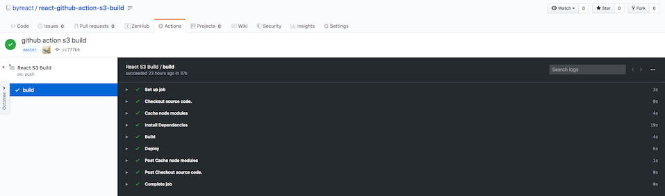
<br />

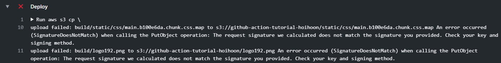
<br />

만약 **SignatureDoesNotMatch** 에러가 발생한다면

`main.yml` 파일에서 ${{ }} 형태의 코드를 '${{ }}' 이런 형태로 '' 감싸 변경해주시면 됩니다.

정상적으로 되었으면 이제 S3에서 정적 웹 사이트 호스팅 엔드포인트로 접근합니다.

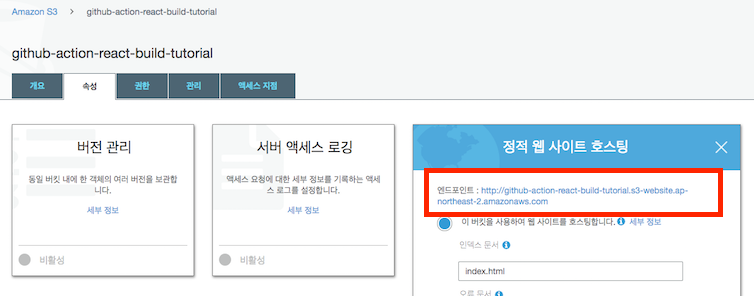
<br />

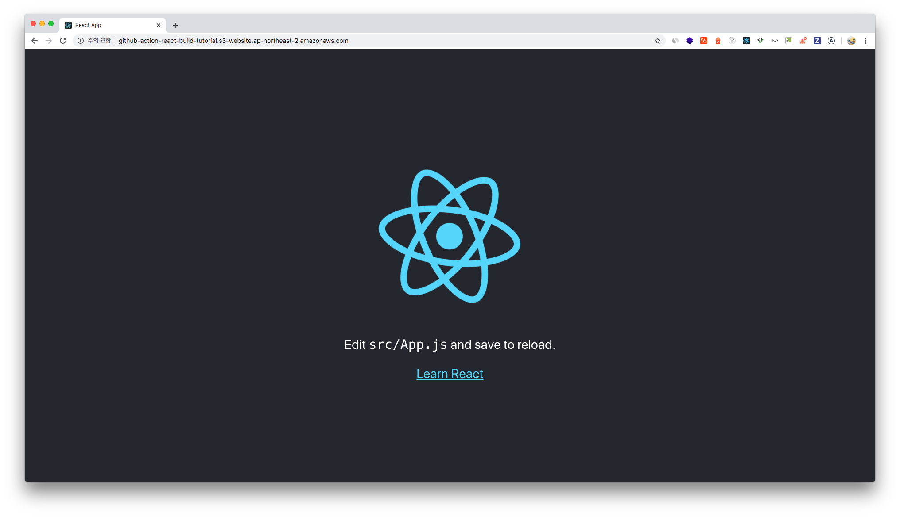
<br />

짠! 정상적으로 되는걸 확인할 수 있습니다.

<br />

**[⬆ 목차](#-목차)**

<hr />

## **🥀 결론**

이것으로 **Github Actions + React + S3** 포스팅이 끝났군요 🎉

다들 잘 따라오셨을거라고 생각합니다 😆

Github Actions이 이제 CI의 한 획을 그을거라고 생각하면서 잘 공부해보시길 바랍니다.

자 마지막으로 배운 내용을 정리하면

1. AWS S3 정적 사이트 설정하기

2. React Github Actions 사용하여 S3 배포하기

를 해보았습니다.

해당 포스팅을 끝까지 읽어 주셔서 감사합니다.

다음에는 더 좋은 포스팅 주제로 찾아뵙겠습니다. 👋

<br />

**[⬆ 목차](#-목차)**

<hr />

<br />

> 출처
>
> <a href="http://github-action-react-build-tutorial.s3-website.ap-northeast-2.amazonaws.com/" target="_blank">Demo Site</a> <br />
> <a href="https://github.com/byreact/react-github-action-s3-build" target="_blank">GitHub > react-github-action-s3-build</a>

# 여러분의 댓글이 큰힘이 됩니다. (๑•̀ㅂ•́)و✧
