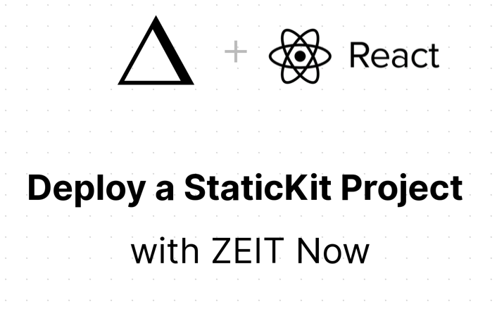
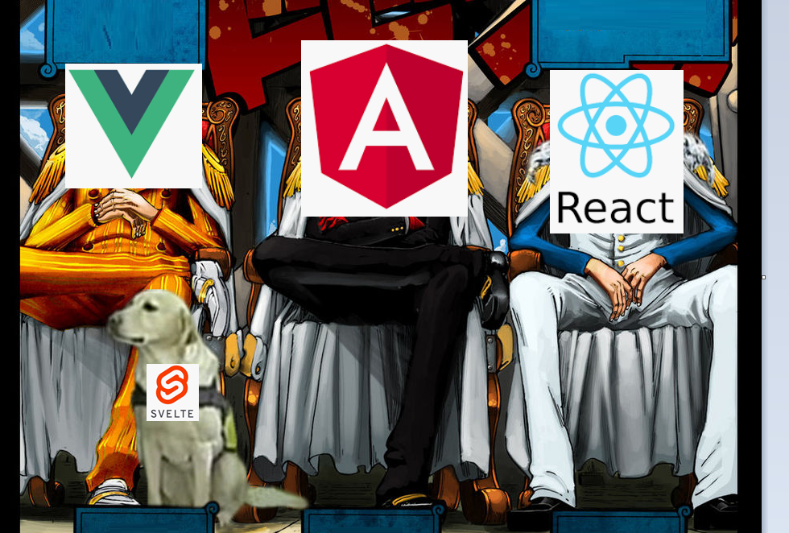
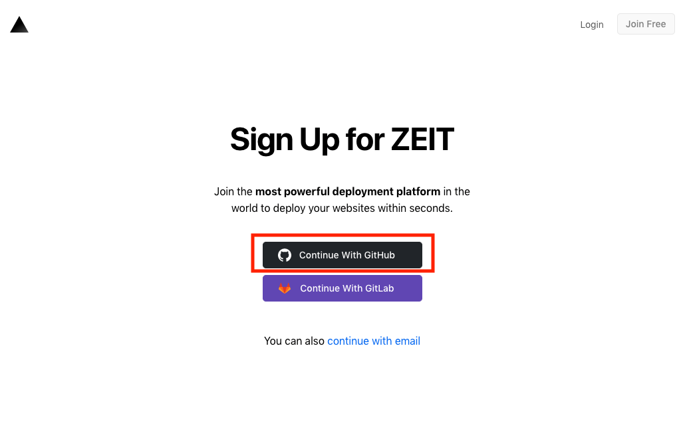
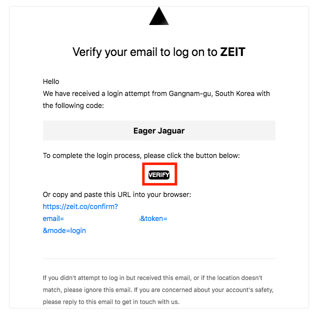
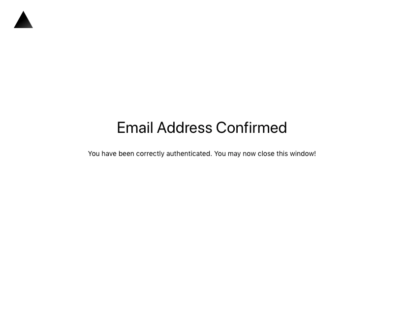
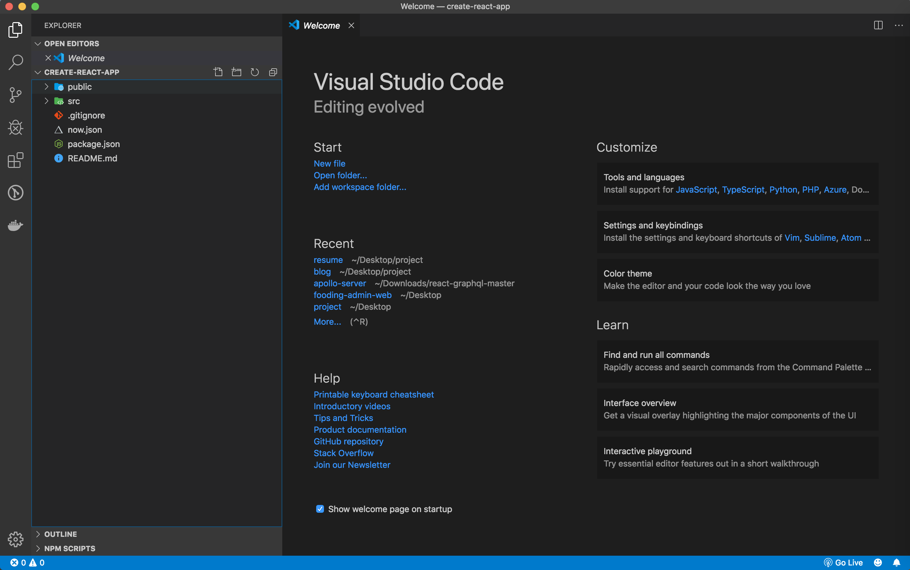
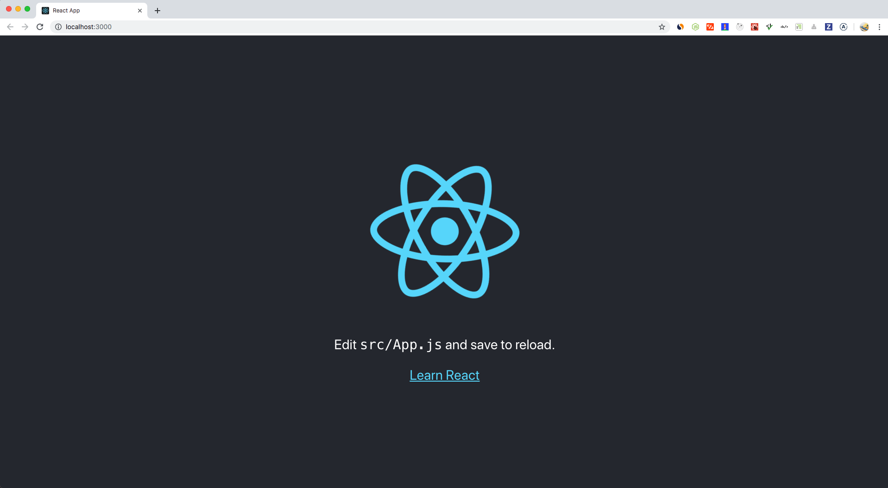
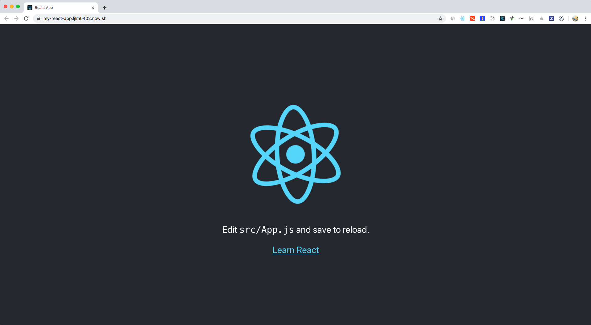

<center>나만의 <strong style="color:#2D2D2D; font-size: 20px;">이력서</strong> 홈페이지</center>

## **💎 목차**

- [서론 (Introduction)](#-서론)
- [본론 (Main)](#-본론)
- [결론 (Conclusion)](#🥀-결론)

## **🌱 서론**

아르바이트나 회사 지원 당시 투박한 문서로 이력서를 제출한 기억이 있는가 ? 🤔

나 또한, 대학교 입학원서, 회사 입사 당시 워드 파일로 이력서를 작성한 경험이 있다.

2017년 대학교에서 주최한 포트폴리오 경진대회에서 홈페이지를 제작해주는

[Wix](https://ko.wix.com/) 서비스로 [포트폴리오](https://ljlm0402.wixsite.com/mypr)를 제작하여 최우수상을 수상하였다.


이처럼 포트폴리오는 보는 사람의 이목을 집중시켜야 한다. 👀

시간을 흘러 2️⃣0️⃣1️⃣9️⃣,

나는 2년간 개발자로 한 단계 성장하여 나만의 이력서 홈페이지를 제작해보았다.

<br />

**[⬆ 목차](#-목차)**

---

## **🌹 본론**

### **▸ 기술 스택**

개발에 앞서 먼저 어떻게 개발을 해야하는지 생각을 해보았다.

웹 페이지를 구성할려면 기본적으로 `프론트엔드`, `호스팅 서버`가 필요하다.

#### **▸ 프론트엔드**

프론트 엔드란,

사용자들의 화면에 보이는 웹 하면을 의미한다.


<br />

해당 이미지는 개발자들 사이에서 유명한 원피스 3대장 패러디 이미지이다.

프론트엔드는 좌측 부터 `Vue (뷰)`, `Angular (앵귤러)`, `React (리액트)` 3대장이라고 불리며

그 중에서 나는 `React (리액트)`로 개발을 진행하였다.

<br />
<hr />

#### **▸ 호스팅 서버**

호스팅 서버란,

웹 사이트를 구축하기 위해서는 웹 서버가 필요하다.

예를들어 소스를 (www.domain.com)을 입력하여 볼수있도록 해주는 서버이다.

그러나, 소규모 웹 사이트 구축에 비용을 지불하기에는 부담이 크다고 판단

무료 호스팅 서버를 알아보면서 [ZEIT](https://zeit.co)를 알게 되었다.

##### **▸ ZEIT**

ZEIT 란,

웹 사이트를 배포 지원해주는 서비스이다.

사용 방법에 대해 차근차근 살펴보자.

**1. npm now 설치**

```sh

$ npm install now -g

```

<br />
<hr />

**2. ZEIT 회원가입**


<br />

[ZEIT](https://zeit.co) 홈페이지에 접속하여 회원가입을 진행한다.

나는 `Continue With GitHub`를 선택하였다.

<br />
<hr />

**3. now login**

```sh

$ now login
> UPDATE AVAILABLE The latest version of Now CLI is 16.2.0
> Please run `npm install -g now@latest` to update Now CLI.
> Changelog: https://github.com/zeit/now-cli/releases/tag/16.2.0
> Enter your email: ljlm0402@naver.com

```

메일을 수신받을 이메일을 기입한다.
<br />



메일이 도착하면 `VERIFY`를 클릭
<br />


<br />

성공적으로 이메일 인증이 되었다.

<br />

```sh

$ now login
> UPDATE AVAILABLE The latest version of Now CLI is 16.2.0
> Please run `npm install -g now@latest` to update Now CLI.
> Changelog: https://github.com/zeit/now-cli/releases/tag/16.2.0
> We sent an email to 'ljlm0402@naver.com' Please follow the steps provided
inside it and make sure the security code matches Eager Jaguar.
✔ Email confirmed
> Ready! Authentication token and personal details saved in "~/.now"

```

터미널에서도 이메일 인증을 확인할 수 있다.

<br />
<hr />

**4. 프로젝트 선택**

```sh

$ now init
> UPDATE AVAILABLE The latest version of Now CLI is 16.2.0
> Please run `npm install -g now@latest` to update Now CLI.
> Changelog: https://github.com/zeit/now-cli/releases/tag/16.2.0
> Select example: (Use arrow keys)
❯ amp
apollo
bash
charge
create-elm-app
create-react-app
docz
express
express-twitter-dreamify
flaskex-postgresql
gatsby
go-image-to-ascii
gridsome
html-minifier
jekyll
.
.
.

```

이 처럼 다양한 프로젝트가 존재하며 원하는 것을 선택하면 된다.

나는 리액트를 하기위해서 `create-react-app`을 선택했다.

<br />


<br />

프로젝트가 성공적으로 생성되었다.

실행을 시켜보겠다.

```sh

$ npm install
$ npm start

```

<br />


<br />

성공적으로 실행이 되었으며 웹 호스팅을 진행해보겠다.

<br />
<hr />

**5. 프로젝트 빌드**

```sh

$ now
> UPDATE AVAILABLE The latest version of Now CLI is 16.2.0
> Please run `npm install -g now@latest` to update Now CLI.
> Changelog: https://github.com/zeit/now-cli/releases/tag/16.2.0
> Deploying ~/Desktop/create-react-app under ljlm0402
> Using project my-react-app
> Synced 1 file (506.69KB) [2s]
> https://my-react-app-gksvou2um.now.sh [v2] [2s]
⠏ Building...

> Ready! Aliased to https://my-react-app.ljlm0402.now.sh [in clipboard] [49s]

```


<br />


<br />

[ZEIT](https://zeit.co) 홈페이지를 통해 빌드가 성공적으로 된걸 확인했으며

이제 DOMAINS로 접속해보자!


<br />

상단 주소검색창을 확인하면 웹 호스팅이 정상적으로 되었다.

<br />

**[⬆ 목차](#-목차)**

---

## **🥀 결론**


<br />

잘 따라오시느라 고생하셨습니다. 👏🏻

오늘 배운 내용을 정리하면

1. ZEIT NOW 웹 호스팅 셋팅

2. create-react-app 프로젝트 생성

**2탄** 에서는 `GitHub Webhook 통한 CI / CD` 해보겠습니다.

<br />

**[⬆ 목차](#-목차)**

---

<br />

# 여러분의 댓글이 큰힘이 됩니다. (๑•̀ㅂ•́)و✧
