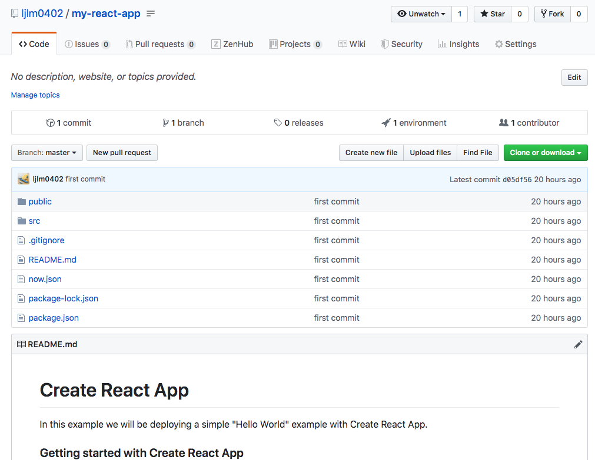
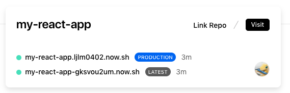
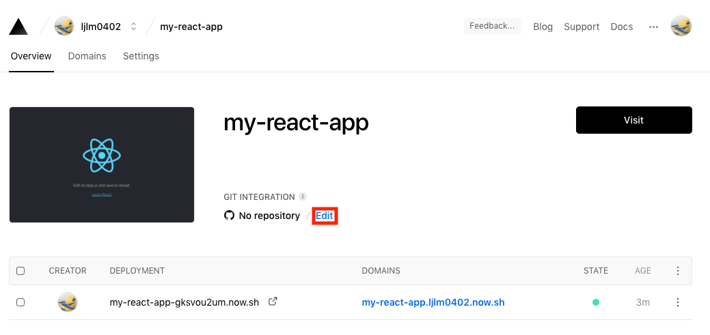
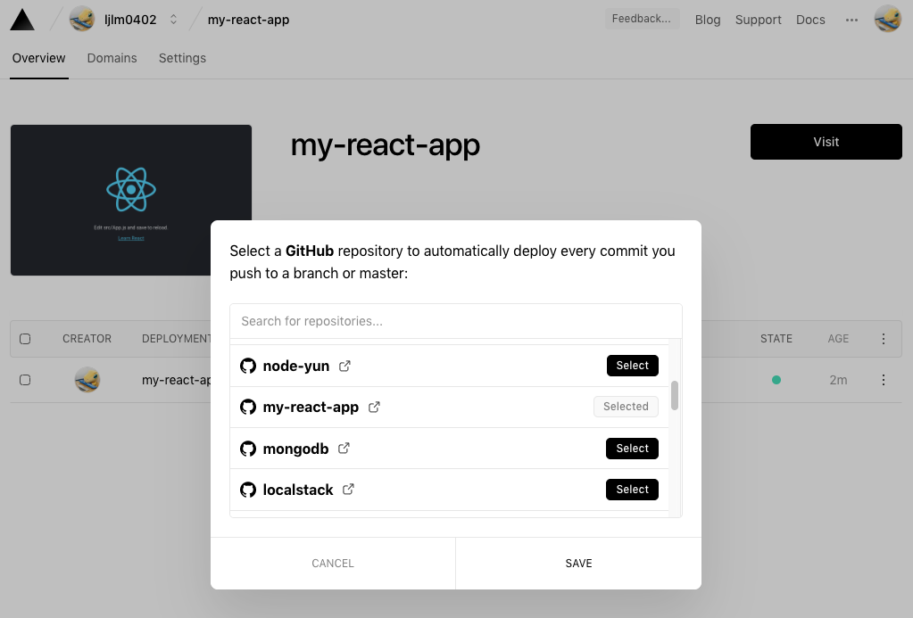
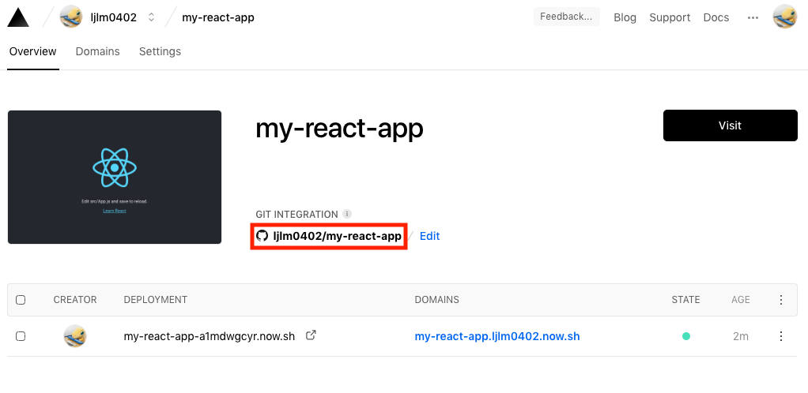
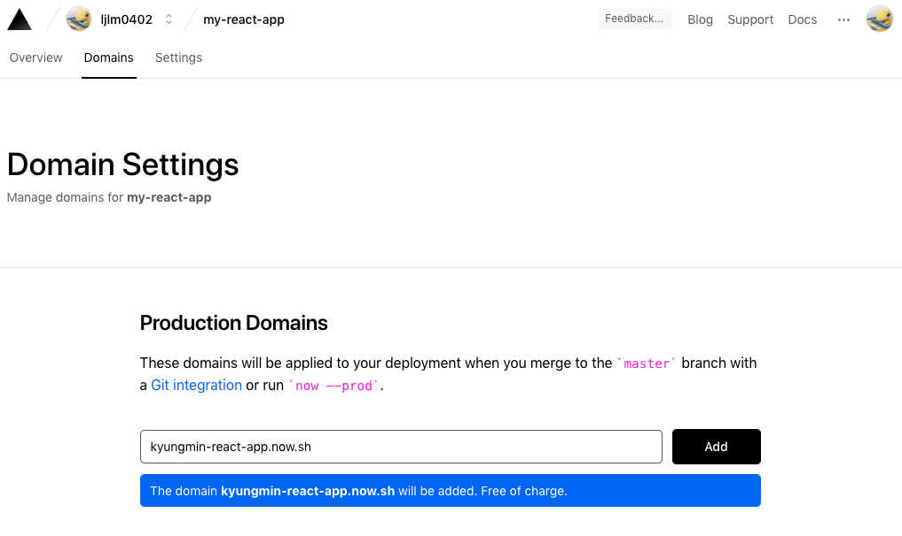
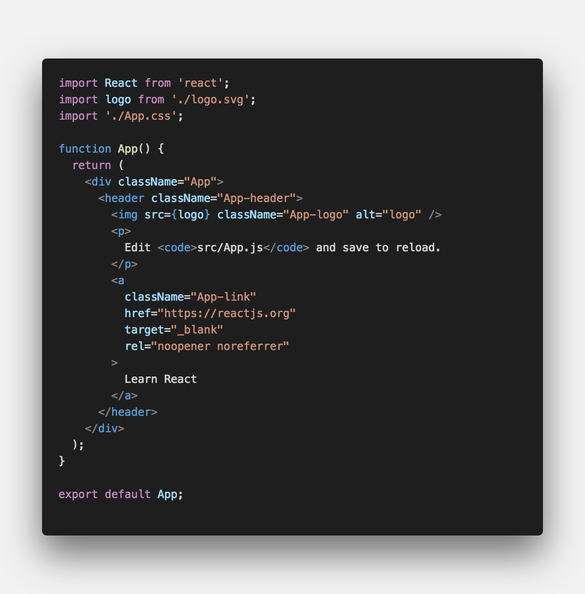
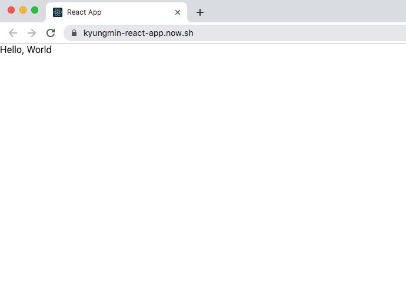

<center>나만의 <strong style="color:#2D2D2D">이력서</strong> 홈페이지</center>

## **💎 목차**

- [서론 (Introduction)](#-서론)
- [본론 (Main)](#-본론)
- [결론 (Conclusion)](#🥀-결론)

## **🌱 서론**


<br />

안녕하세요~ 어느덧 가을 🍂이 찾아왔습니다.

1탄에 이어서 2탄을 진행 해보겠습니다.

그전에 배운 내용을 정리하면

1. ZEIT NOW 웹 호스팅 셋팅

2. create-react-app 프로젝트 생성

까지 진행했습니다.

**2탄** 에서는 `GitHub Webhook 통한 CI / CD` 해보겠습니다.

<br />

**[⬆ 목차](#-목차)**

---

## **🌹 본론**

### **▸ GitHub Webhook**

Github webhook 이란,

Github 저장소에 commit을 할 경우 자동으로 ZEIT에 배포되는 방식입니다.

차근차근 살펴보도록 하겠습니다.

**1. 레포지토리 생성 & 커밋**


<br />

**Repositoy name** 을 `my-react-app` 설정하여 생성합니다.

```sh

$ git init
$ git add .
$ git commit -m "first commit"
$ git remote add origin [Your GitHub Repository URL]
$ git push -u origin master

```

그리고 앞서 생성했던 `create-react-app` 프로젝트를 커밋해줍니다.


<br />

정상적으로 커밋이 완료되었습니다.

<hr />

**2. ZEIT 설정**

[ZEIT](https://zeit.co) 홈페이지를 접속합니다.


<br />

**1탄** 에서 빌드했던 프로젝트가 존재합니다.

해당 프로젝트를 클릭합니다.


<br />

GIT INTEGRATION **Edit** 를 클릭해 줍니다.


<br />

위에서 생성한 레포지토리를 선택 후 저장합나다.


<br />

**No repository** 가 변경된 것을 확인할 수 있습니다.

추가적으로 **Domains** 를 클릭 해줍니다.


<br />

자신의 도메인이 원하는 도메인을 입력후 Add 버튼 클릭

`단, *.now.sh` 형식으로 도메인을 입력해야합니다.

만약,

```sh

[Youar Domain] is owned by another ZEIT account.

```

라는 문구가 뜨면 이미 사용하고 있는 도메인이니 변경해주세요.


<br />

성공적으로 되었으면 `GitHub Webhook` 작업을 끝이 났습니다.

테스트를 위해서 프로젝트로 넘어가겠습니다.


<br />

**src/App.js** 소스를 아래 이미지처럼 변경후에 커밋을 해보겠습니다.


<br />

그 후에 아까 설정했던 도메인을 접속을 해보면


<br />

해당 이미지처럼 나온다면 정상적으로 **자동화 배포** 가 되었습니다.

<br />

**[⬆ 목차](#-목차)**

---

## **🥀 결론**


<br />

**차근차근 잘 따라온 당신! 최고입니다.**

<hr />

오늘 배운 내용을 정리하면

1. GitHub 레포지토리 생성 & 커밋

2. [ZEIT](https://zeit.co) 홈페이지에서 GIT INTEGRATION 연결

**3탄** 에서는 `간단하게 화면구성`을 해보겠습니다.

<br />

**[⬆ 목차](#-목차)**

---

<br />

# 여러분의 댓글이 큰힘이 됩니다. (๑•̀ㅂ•́)و✧
