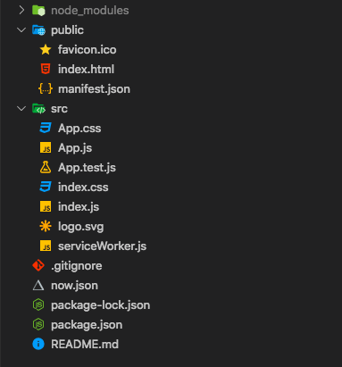
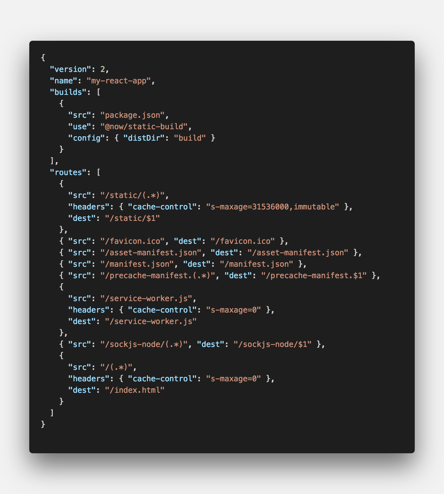
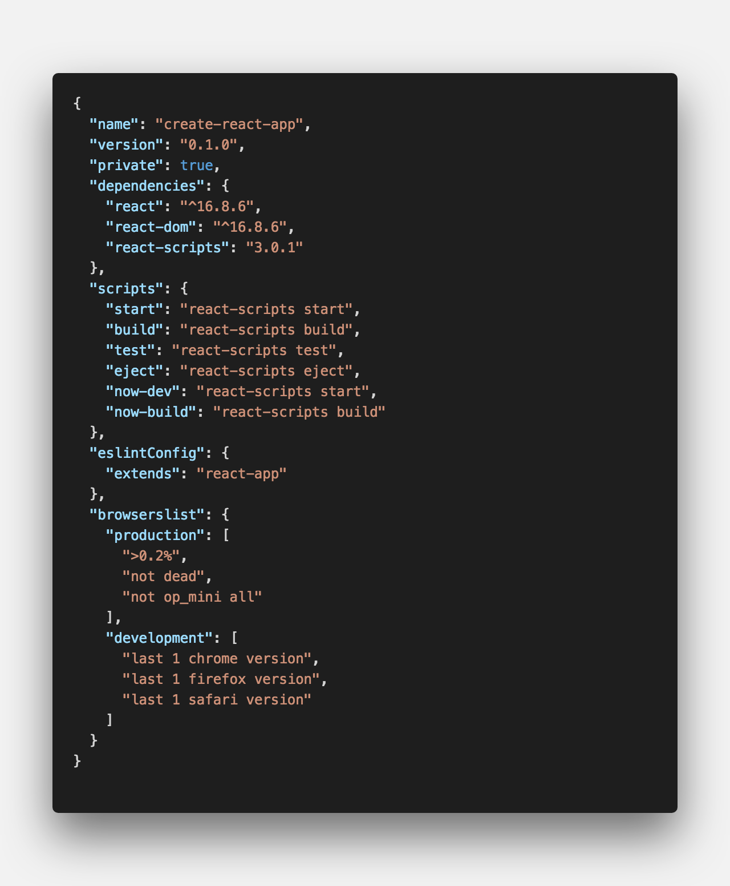
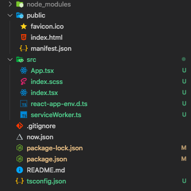
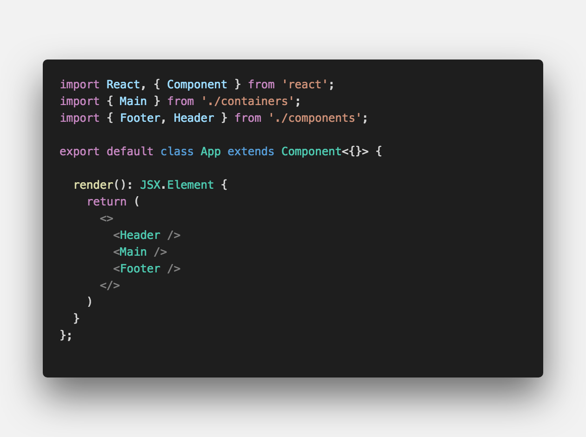
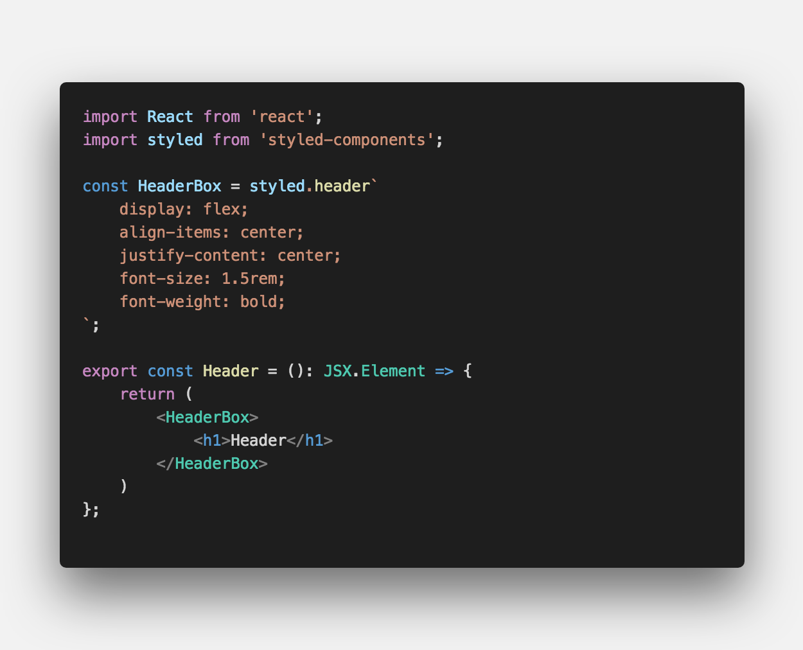
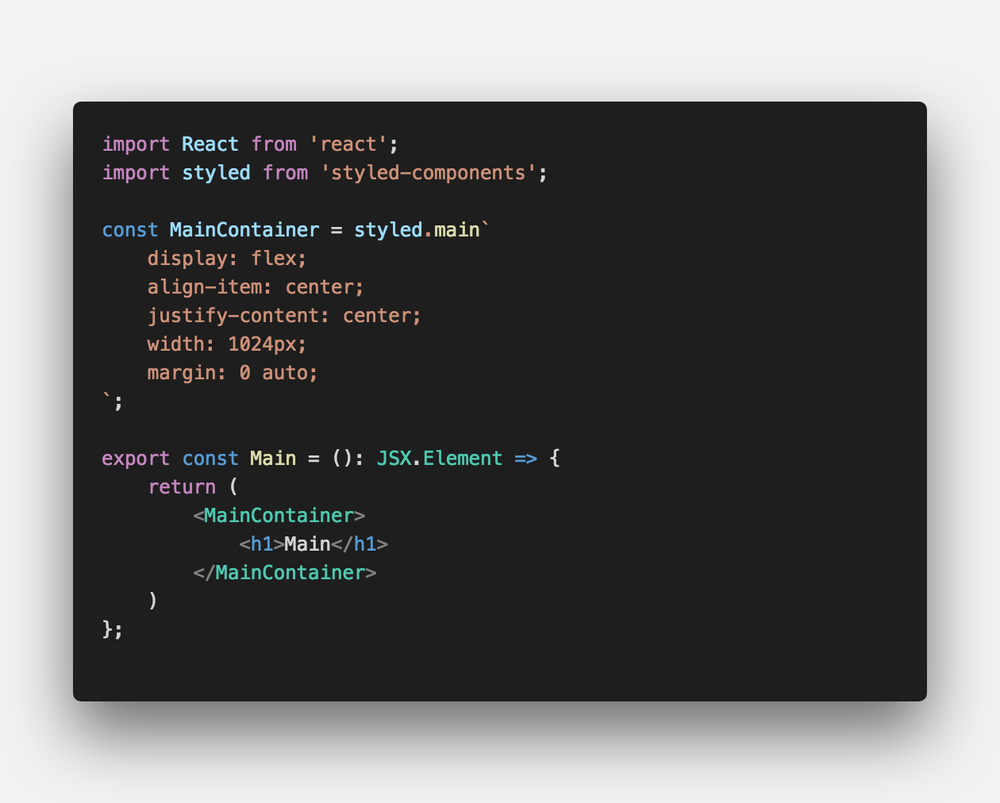
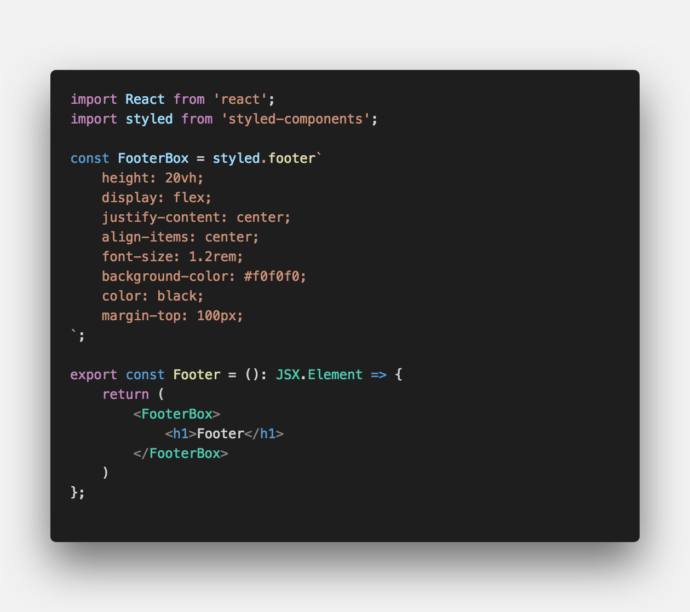
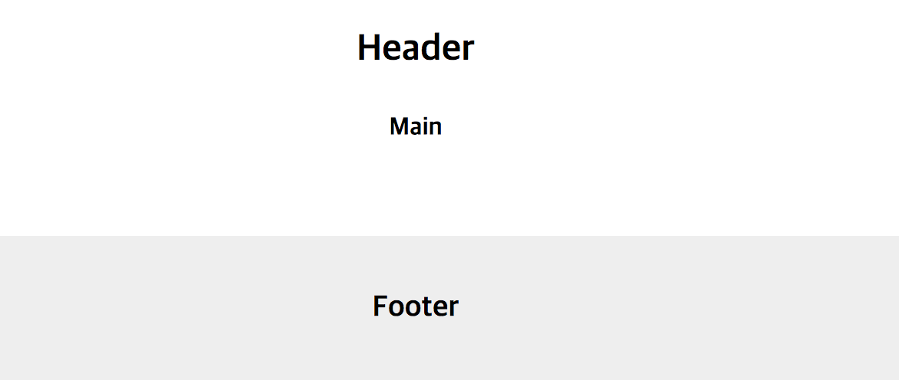

<center>나만의 <strong style="color:#2D2D2D; font-size: 20px;">이력서</strong> 홈페이지</center>

## **💎 목차**

- [서론 (Introduction)](#-서론)
- [본론 (Main)](#-본론)
- [결론 (Conclusion)](#🥀-결론)

## **🌱 서론**


<br />

두둥! 드디어 마지막 **3탄** 으로 찾아 뵙습니다.

마지막으로 그 동안 배운 내용을 정리하면

1. ZEIT NOW 웹 호스팅 셋팅

2. create-react-app 프로젝트 생성

3. GitHub 레포지토리 생성 & 커밋

4. [ZEIT](https://zeit.co) 홈페이지에서 GIT INTEGRATION 연결

까지 진행하여 화면 구성만을 남아두고 있습니다.

해당 포스팅의 경우는 `주관적인 요소`가 많이 포함되어 있으므로

그점 양해해서 봐주시길 바랍니다.

<br />

**[⬆ 목차](#-목차)**

<hr />

## **🌹 본론**

프로젝트를 천천히 살펴보겠습니다.


<br />

폴더 구조부터 살펴보면 기존 `create-react-app` 앱에서는 볼수없는 파일이 존재합니다.

바로 `now.json` 파일입니다.

한번 살펴보겠습니다.

### **▸ now.json**


<br />

`now.json` 파일은 ZEIT Now 빌드를 위한 파일입니다.

`name` [ZEIT](https://zeit.co) 홈페이지에서 프로젝트 이름입니다.

그 다음으로 가장 중요시되는 파일 `package.json`

### **▸ package.json**


<br />

기존 `create-react-app`과 동일합니다.

하지만 저는 `TypeScript`로 개발하기 위해서

몇가지 모듈을 설치하겠습니다.

```sh

$ npm install typescript

$ npm install styled-components

$ npm install node-sass

$ npm install @types/node

$ npm install @types/react

$ npm install @types/react-dom

$ npm install @types/styled-components

```

`typescript`, `styled-components`, `scss` 모듈을 설치했습니다.

그 후에 파일들을 js 파일을 ts로 변경 및 필요없는 파일들은 삭제


<br />

짠! 이제 깔끔해 졌으니 폴더 구조를 잡아 보겠습니다.

### **▸ source**

**App.tsx**


<br />

**Header.tsx**


<br />

**Main.tsx**


<br />

**Footer.tsx**


<br />

홈페이지는 기본적으로 `header`, `main`, `footer` 구성하면 안정적입니다.

1. `App.tsx`에서 Header, Main, Footer 랜더

2. `styled-components` 모듈를 사용하여 스타일 적용

<br />

**결과**


<br />

기본적인 구조를 잡았습니다.

이제부터는 여러분들이 원하시는 스타일로 개발하시면 됩니다.

<br />

**[⬆ 목차](#-목차)**

<hr />

## **🥀 결론**


<br />

다소 미흡하다만 잘 보고 따라하셨다면 자신만의 페이지를 만들었다고 생각합니다.

또한 [ZEIT](https://zeit.co) 말고도 다른 호스팅 서비스와 비교해보는것도 좋을거같습니다.

출처에는 관련 링크가 있으니 참고하면서 자신만의 페이지를 만들어보시기 바랍니다.

다음에는 더 좋은 포스팅으로 찾아 뵙겠습니다.

감사합니다.

<br />

**[⬆ 목차](#-목차)**

<hr />

<br />

> 출처
>
> <a href="https://kyungmin-resume.now.sh/" target="_blank">Resume | 경민</a> <br />
> <a href="https://github.com/ljlm0402/resume" target="_blank">GitHub > resume</a>

# 여러분의 댓글이 큰힘이 됩니다. (๑•̀ㅂ•́)و✧
