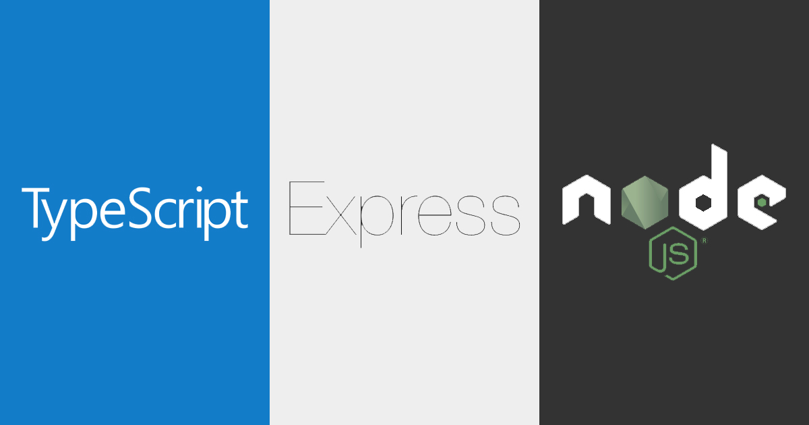
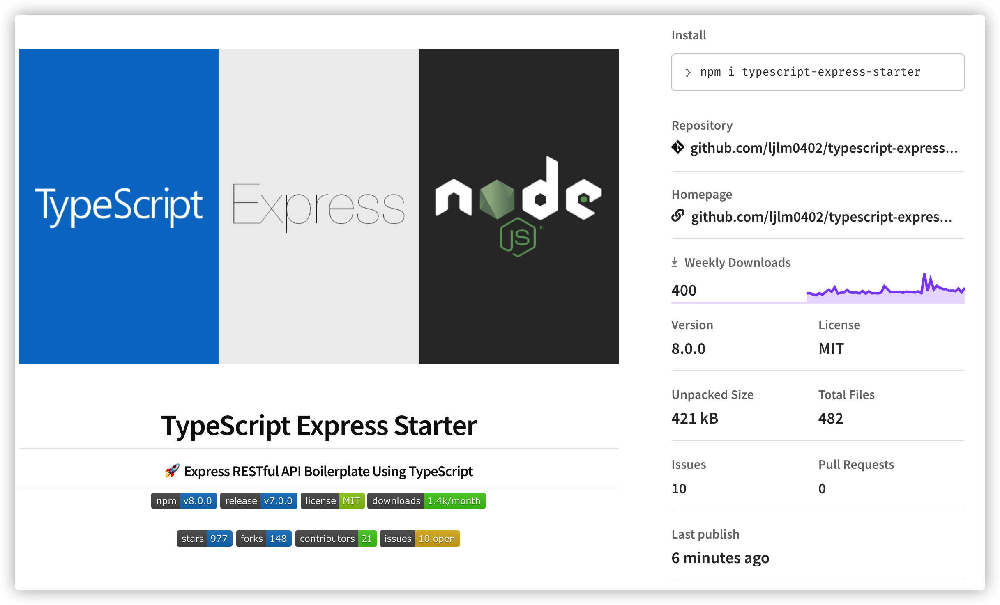
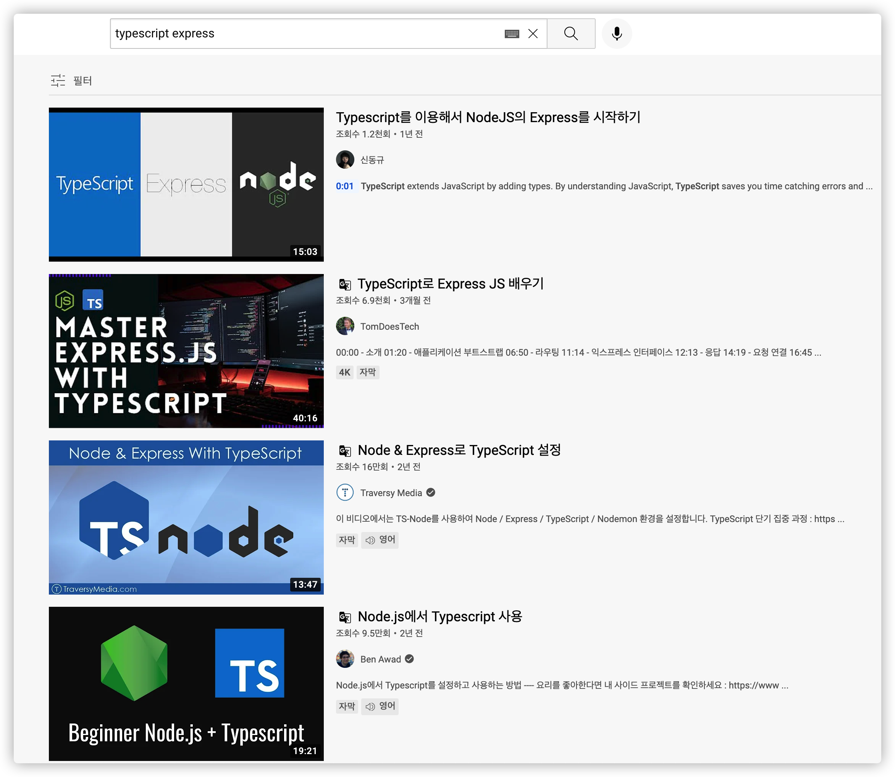
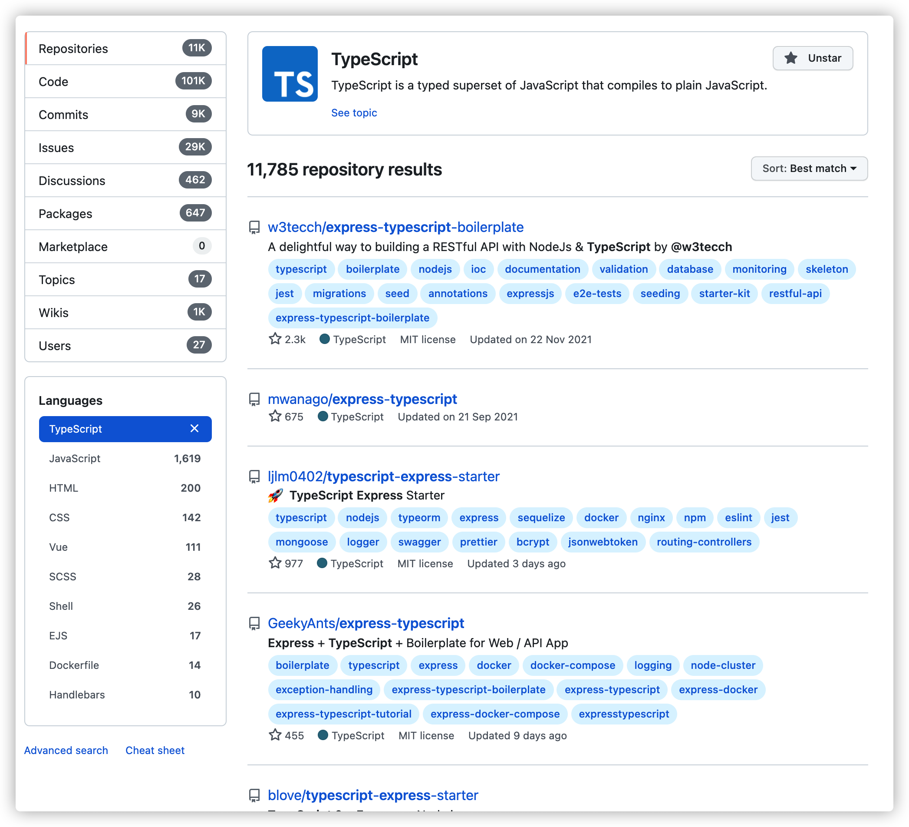

<center><strong style="color:#2A7CF2; font-size: 20px;">TypeScript</strong> Express Starter 개발일지</center>

## **💎 목차**

- [서론 (Introduction)](#-서론)
- [본론 (Main)](#-본론)
- [결론 (Conclusion)](#🥀-결론)

## **🌱 서론**

- [TypeScript Express Starter](https://github.com/ljlm0402/typescript-express-starter)는 타입스크립트 기반의 익스프레스 보일러 플레이트 스타터 패키지입니다.

- 금일 날짜(2022-01-12) 기준
  - github [stars: 977개](https://github.com/ljlm0402/typescript-express-starter/stargazers), [forks: 147](https://github.com/ljlm0402/typescript-express-starter/network/members)를 보유
  - [npm](http://npm.im/typescript-express-starter) 패키지로 v8.0.0 배포

<br />



<br />

- 이번에 포스트에서는 해당 오프소스 개발일지에 대해 작성해 보도록 해보겠습니다. ☺️

<br />

**[⬆ 목차](#-목차)**

<hr />

## **🌹 본론**

### **▸ 개발 계기**

해당 프로젝트를 관심을 가져주시고 좋아해주시는 분들도 저와 같은 생각으로 이 프로젝트를 알아보시고 사용해본거 같습니다.

저 또한 프로젝트를 개발하기 이전에 Express 공식 홈페이지에서 제공해주는 [Express 애플리케이션 생성기](https://expressjs.com/ko/starter/generator.html)(express-generator)를 사용하였습니다.

그러나, 타입스크립트의 인기가 부상하면서, 자바스크립트의 단점인 Type 유형에 취약하다는 점과 여러 단점을 보완했다는 무척이나 마음에 들었습니다.

그러하여, [nest](https://nestjs.com/)라는 Node.js 서버측 애플리케이션을 구축하기 위한 프레임워크의 인기가 올라가며 강력한 CLI를 보유하여 많은 입문자들에게 좋은 평을 받고 있습니다.

추가적으로 [Angular](https://angular.io/cli), [React](https://create-react-app.dev/docs/adding-typescript/), [Vue](https://kr.vuejs.org/v2/guide/typescript.html) 또한, TypeScript 기반의 CLI를 제공하면서 TypeScript로 개발하는 기업, 개인 프로젝트도 더욱 많아지고 있습니다.

하지만, Express 공식에서는 TypeScript 기반의 cli를 제공하지 않아, `TypeScript Express`에 대해 다양하게 경로에서 검색해보았습니다.

<br />



<br />



<br />

실제로 유튜브, GitHub에 검색해본 `typescript express` 목록입니다.

이처럼 많은 개발자분들이 타입스크립트 기반으로 개발된 Express에 관심이 많다는걸 알 수 있습니다.

그 계기를 토대로 내가 한번 만들어보자! 라는 마음으로 프로젝트를 개발하게 되었습니다.

<br />
<hr />

### **▸ 개발 과정**

#### [1] 폴더 구조 정의

맨 처음 개발하기 앞서, 두가지를 먼저 생각했습니다.

첫번째로는 폴더 구조(Structure)입니다.

node.js 프로젝트 구조는 코드의 중복을 피해주고 안정성을 높여주며, 당신의 서비스를 확장하는데 가장 큰 요소입니다.

그러하여, 가장 많은 시간을 고민을 하였으며, 다양한 예제와 경험을 통해서 두가지 중 하나를 선택할려고 했습니다.

##### 기능 별로 모아서 관리

```bash
/src
│
├───/controllers
│   ├── auth.controller.ts
│   └── users.controller.ts
│
├───/models
│   ├── auth.model.ts
│   └── users.model.ts
│
├───/routes
│   ├── auth.route.ts
│   └── users.route.ts
│
└───/services
    ├── auth.service.ts
    └── users.service.ts
```

`Model - Routes - Controllers - Services`구조로 폴더 기능 단위로 폴더를 구별하였습니다.

각 폴더 기능을 정리해 보았습니다.

- Models: 스키마를 정의

- Routes: API 경로를 Controller에 매핑합니다.

- Controllers: 요청 매개변수 유효성 검사, 쿼리, 올바른 코드로 응답 보내기 이면의 모든 논리를 처리

- Services: 데이터베이스 쿼리 및 객체 반환 또는 오류 발생

이러한 장점은 기능별로 묶어서 관리하기 때문에 역할에 대한 정의가 확실합니다.

##### 도메인 별로 모아서 관리

```bash
/src
│
├───/users
│   ├── users.controller.ts
│   ├── users.model.ts
│   ├── users.route.ts
│   └── users.service.ts
│
└───/auth
    ├── auth.controller.ts
    ├── auth.model.ts
    ├── auth.route.ts
    └── auth.service.ts
```

도메인 별로 묶어서 관리하는 방식으로 `nestjs`에서 사용하는 방식과 유사합니다.

이러한 장점은 각 도메인 별로 묶어서 관리하여, 특정 도메인 기능을 수정 할때 유리합니다.

두번째 방식의 경우 controller router 방식으로 운영을 많이하여, route를 별도로 분리하는 경우가 없습니다.

controller - service를 module 단위로 묶어서 관리하는 방식이 nestjs가 추구하는 방향입니다.

하지만, 제가 원하는 방식은 Routes - Controllers - Sservices 를 추구하는 방향으로 맞지 않아 첫번째 방식을 선택하였습니다.

#### [2] 문법 정의
##### 함수(Function)형 문법

서론에서 기존의 `express-generator` 생성한 프로젝트의 구조를 잠깐 살펴보겠습니다.

```js
var express = require('express')
var app = express()

app.use(express.json())
app.use(express.urlencoded({ extended: false }))

var indexRouter = require('./routes/index')
var usersRouter = require('./routes/users')

app.use('/', indexRouter)
app.use('/users', usersRouter)

app.listen(3000)
```

해당 프로젝트는 함수형(function)기반으로 개발이 되어있습니다.

함수형의 경우는 자유도가 높고 선언하기가 좀더 편리합니다.

그러하여, React의 경우도 클래스형 컴포넌트에서 함수형 컴포넌트로 사용을 권장하며 바뀌어가고 있습니다.

자바스크립트의 특징을 극대화한다는 점에서도 매우 좋았습니다.

##### Class(OOP)형 문법

ES6부터 클래스형([Class](https://developer.mozilla.org/ko/docs/Web/JavaScript/Reference/Classes))이 등장하면서 나오면서 관심을 갖고

많은 프로그래머가 객체지향 프로그래밍보다 클래스 기반 언어(Java, C)에 익숙한 점에서 보다 빠르게 학습할 수 있다는 점과, 재사용성이 좋다는 점 선택하게 되었습니다.

아래 코드는 위에 코드를 클래스형으로 변경해본 샘플 코드입니다.

```ts
import express from 'express';

class App {
  public app: express.Application;

  constructor(routes: Routes[]) {
    this.app = express();

    this.initializeMiddlewares();
    this.initializeRoutes(routes);
  }

  public listen() {
    this.app.listen(3000);
  }


  private initializeMiddlewares() {
    this.app.use(express.json());
    this.app.use(express.urlencoded({ extended: true }));
  }

  private initializeRoutes(routes: Routes[]) {
    routes.forEach(route => {
      this.app.use('/', route.router);
    });
  }
}

export default App;
```

어느 코드가 더 보기 편리하신가요 ??

저 같은 경우는 class형이 좀더 마음에 들었습니다. 그 이유로는 class 안에서 각 기능이 명확하게 보인다는 점이 좋았습니다.

`constructor`(생성자)를 이용해서 class 객체의 초기값을 설정하여, 미들웨어, 라우터를 선언하는게 가시적으로 확인 된다는 점입니다.

이 처럼 각 기능별 메서드를 구별하여서 관리하는 포인트 또한 마음에 드는거 같습니다.

추후에는 `extends`(상속)개념을 통해서, 하위 속성에 적용하여 재사용성을 높히는 방안도 고려하였습니다.

궁극적인 이유는 많은 예제에서는 함수형으로 개발을 하여, 차이점을 준다는 점도 있었습니다. 🤣

<br />

**[⬆ 목차](#-목차)**

<hr />

## **🥀 결론**

정답은 존재하지 않지만, 어떻게 접근하냐에 따라서 편의성이 달라지는거 같습니다.

제가 생각하는 구조, 문법이 정답은 아니며, 해당 구조와 문법에 장점을 극대화하는 방향이 맞다고 생각합니다.

여러분 생각하는 구조와 문법은 어떤가요 ??

오늘 포스팅은 여기서 마치겠습니다.

다음 포스팅에서는 route, controller, service 문법 정의에 대해 알아보겠습니다.

<br />

**[⬆ 목차](#-목차)**

<hr />

<br />

> 출처
>
> <a href="https://velog.io/@hopsprings2/%EA%B2%AC%EA%B3%A0%ED%95%9C-node.js-%ED%94%84%EB%A1%9C%EC%A0%9D%ED%8A%B8-%EC%95%84%ED%82%A4%ED%85%8D%EC%B3%90-%EC%84%A4%EA%B3%84%ED%95%98%EA%B8%B0" target="_blank">견고한 node.js 프로젝트 설계하기</a><br />
> <a href="https://softwareontheroad.com/ideal-nodejs-project-structure/" target="_blank">Bulletproof node.js project architecture</a><br />
> <a href="https://sodocumentation.net/node-js/topic/10785/route-controller-service-structure-for-expressjs" target="_blank">Route-Controller-Service structure for ExpressJS</a>

# 여러분의 댓글이 큰힘이 됩니다. (๑•̀ㅂ•́)و✧
