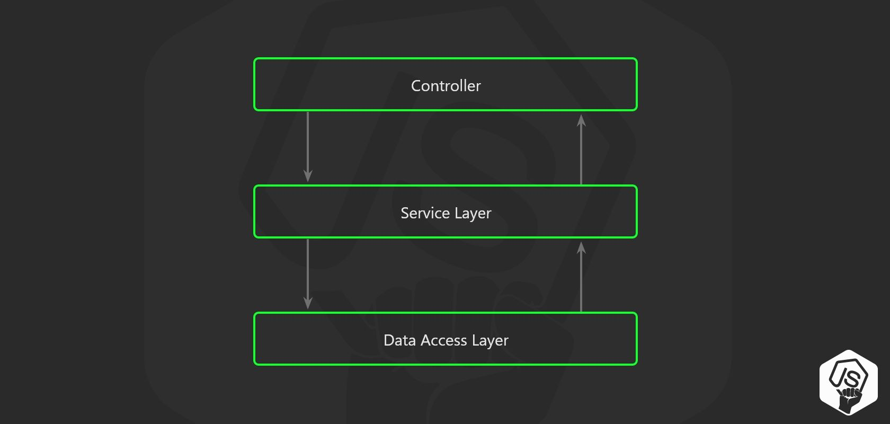
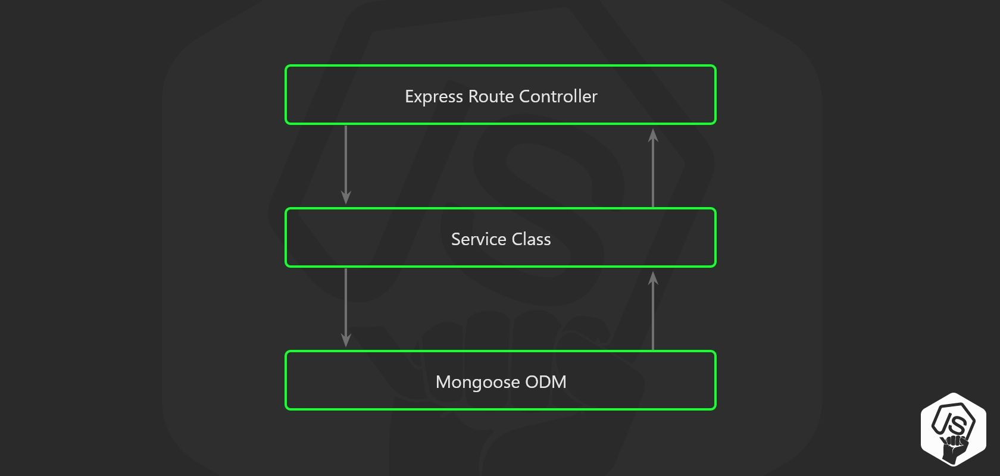

<center><strong style="color:#2A7CF2; font-size: 20px;">TypeScript</strong> Express Starter 개발일지</center>

## **💎 목차**

- [서론 (Introduction)](#-서론)
- [본론 (Main)](#-본론)
- [결론 (Conclusion)](#🥀-결론)

## **🌱 서론**

안녕하세요 👋

1탄에 이어 2탄으로 찾아뵙습니다.

1탄에서 폴더 구조와 문법에 대해 어떻게 정하게 되었는지 포스팅을 했는데요

이번 포스팅에서는 route, controller, service 문법 정의에 대해 알아보겠습니다.

코드 비교는 이전 포스팅과 유사하게 `express-generator`(JavaScript)를 비교하도록 하겠습니다.

참고해주세요.

<br />

**[⬆ 목차](#-목차)**

<hr />

## **🌹 본론**

1탄의 내용을 토대로 관심사 분리 원칙(principle of separation of concerns)를 적용하기 위해

3 계층 설계 (3 Layer Architecture)인 `Routes - Controllers - Services` 구조라는 개발을 하였습니다.



<br />



<br />

각 계층별로 명확하게 기능을 분리하여 사용하면, 가독성 및 유지보수의 장점이 있습니다.

아래 예시 코드는 제 경험을 토대로 작성한 코드이므로 주관적인 성향이 강하게 있습니다.

코드의 매커니즘에 중점을 두고 봐주시면 감사합니다.

#### **▸ Route**

```ts
import { Router } from 'express'
import UsersController from '@controllers/users.controller'

class UsersRoute {
  public path = '/users'
  public router = Router()
  public usersController = new UsersController()

  constructor() {
    this.initializeRoutes()
  }

  private initializeRoutes() {
    this.router.post(`${this.path}`, this.usersController.createUser)
  }
}

export default UsersRoute
```

[1] constructor 생성자를 통해, 생성된 객체를 생성하고 초기 선언을 합니다.

[2] API 경로를 Controller로 매핑

- route 폴더안에서 논리적인 처리를 하지 않고 매핑만 가독성을 향상시켜 줍니다.

#### **▸ Controller**

```ts
import { NextFunction, Request, Response } from 'express'
import userService from '@services/users.service'

class UsersController {
  public userService = new userService()

  public createUser = async (
    req: Request,
    res: Response,
    next: NextFunction
  ) => {
    try {
      const userData = req.body
      await this.userService.createUser(userData)

      res.status(201).json({ message: 'created' })
    } catch (error) {
      next(error)
    }
  }
}

export default UsersController
```

[1] models 참조하여, 결과 값을 resolve(반환) 혹은 reject(거절)

[2] 요청(Request)에 데이터를 비즈니스 로직을 담당하는 서비스(Service) 계층을 참조하여, 넘기며 응답(Response)합니다.

- Controller 단에서 비즈니스 로직을 구현한다면, 스파게티 코드(엉켜버린 코드)가 되기 마련이다.

- 그러므로, 비즈니스 로직을 담당하는 서비스(Service) 계층을 분리하여, 관리하도록 한다.

#### **▸ Service**

```ts
import userModel from '@models/users.model'

class UserService {
  public users = userModel

  public async createUser(userData) {
    if (userData) throw new Error(400, "You're not userData")

    const findUser: User = await this.users.findOne({
      where: { email: userData.email },
    })
    if (findUser)
      throw new Error(409, `You're email ${userData.email} already exists`)

    await this.users.create({ userData })
  }
}

export default UserService
```

[1] modles(Schema)를 참조하여, 데이터베이스 쿼리 및 객체 반환 또는 오류 발생을 처리합니다.

<br />

**[⬆ 목차](#-목차)**

<hr />

## **🥀 결론**

JavaScript(TypeScript)은 자유도가 높은 언어입니다.

그러한, 특성은 개발자분들에게 장점이자 단점이으로 다가가는데요.

장점이라면, 자신의 입맛대로 코드를 원하는 방식대로 개발이 가능하다는 것입니다.

하지만, 양날검 같은 특징은 입문자 분들의 경우는 막막할 수 있습니다.

Java Spring, nestjs와 같은 정형화 된 코드 레이어를 제공하는 라이브러리는 입문자들이 사용하기에는 굉장히 편리합니다.

물론, 뼈대를 제공받고 그다음부터는 커스텀하게 진행을 하겠지만, 뼈대를 잡는게 가장 난관이긴합니다.

그러하여, express 구조 방식은 깨지 않고 톤업만 시켜 기존 개발자분들도 사용하기 편하도록 개발할려고 노력하고있습니다.

3탄에서는 middleware, error handling에 대해 알아보겠습니다.

이번 포스팅도 잘 봐주셔서 감사합니다.

<br />

**[⬆ 목차](#-목차)**

<hr />

<br />

# 여러분의 댓글이 큰힘이 됩니다. (๑•̀ㅂ•́)و✧
